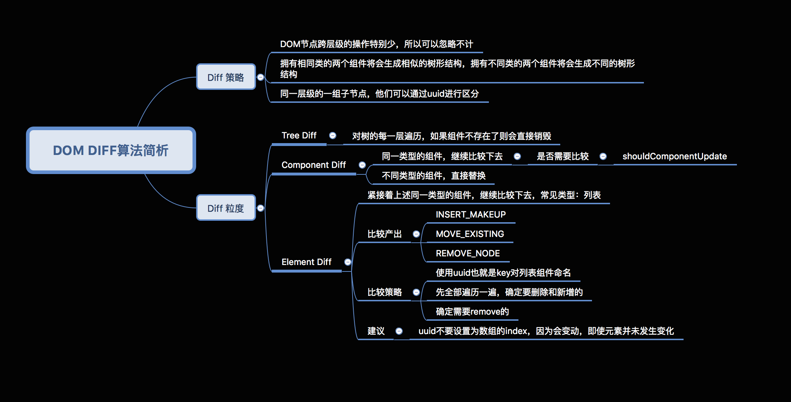

#### React相关
- setState [深入setState](https://github.com/sisterAn/blog/issues/26 '深入setState')
- Diff算法
     

- pureComponent 浅比较
  1. 通过is函数
  2. shallowEqual 会比较 Object.keys(state | props) 的长度是否一致，
  3. 每一个 key 是否两者都有，
  4. 并且是否是 一个引用，也就是只比较了 第一层 的值，确实很浅，所以深层的嵌套数据是对比不出来的。
   
#### Mobx相关

- Mbox [高效的mobx模式](https://segmentfault.com/a/1190000016266272)